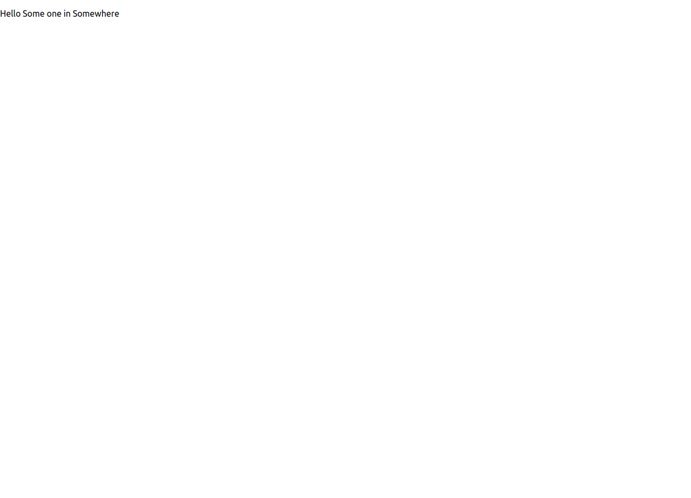

# react-proptypes

This page was created by Stefan Klinkusch at Digital Career Institute in Berlin, Germany using React.js.

## Components
The app contains a `<Greeting>` component accepting a `person` object with name and location properties. Both have to be strings.
Also, default values are provided.

## Screenshot

